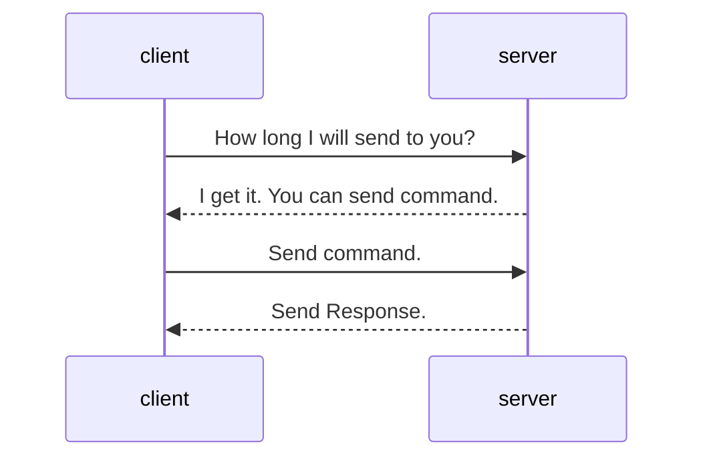

# NamedPipe 交互定义

## 命令格式

调用命令的方式如下。

参数需要使用逗号隔开，如果是字符串，且中间有空格或者逗号分隔符，需要使用双引号将其包起来。

```
<模块>.<方法> [<参数:类型>,]
```

实际调用时不需要指定类型。

## 交互流程

所有的交互流程遵循<u>一发一收</u>的原则。即每次交互都由客户端发起，客户端发送数据时，需要主动结束发送，然后服务端会处理并执行命令，返回客户端需要的结果。



第一次发送，确认接收的数据大小。由客户端将下一次会发送的数据量发送给服务端。数据范围为 `[0, uint.MaxValue]`。

第二次，客户端发送指令给服务端。服务端接收到给定数量的数据之后，就会进行处理和执行，并将执行结果返回客户端。如果没有返回值，则客户端可以在发送完指令后关闭 Stream。

## 目前预计将要实现的命令

| 模块| 方法| 参数| 调用格式| 说明|
|----|----|----|---------|----|
|shell|AcceptInputString|<label: String>|`shell.AcceptInputString <label>`| 该命令会在主窗口弹出一个输入框，输入的字符串会在结束后写入到 Stream 中|
||AcceptInputInt| <label: String>|`shell.AcceptInputInt <label>`|该命令会在主窗口弹出一个输入框，输入的数值会在结束后写入到 Stream 中|
||AcceptInputFloat|<label: String>|`shell.AcceptInputFloat <label>`| 该命令会在主窗口弹出一个输入框，输入的数值会在结束后写入到 Stream 中|
||ShowMessageBox| <message: String>[,<icon: int>]|`shell.ShowMessageBox <message>[,<icon: int>]`| 该命令会在主窗口弹出一个消息框，显示 message 到消息框中，无返回值   |
||SendLogMessage|<message: String>[,<level: int>]|`shell.SendLogMessage <message>[,<level: int>]`|该命令会在主窗口中添加一个日志，无返回值|
