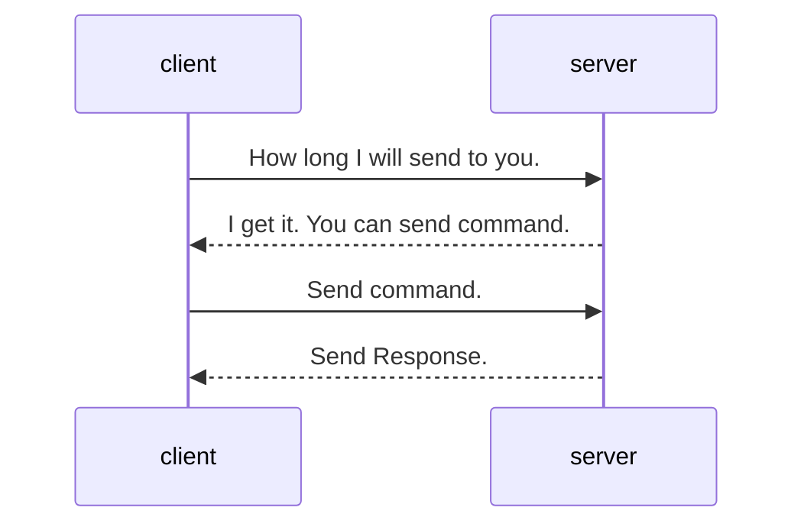

# NamedPipe 交互定义

## 命令格式

调用命令的方式如下。

参数需要使用逗号隔开，如果是字符串，且中间有空格或者逗号分隔符，需要使用双引号将其包起来。

```
<模块>.<方法> [<参数:类型>,]
```

实际调用时不需要指定类型。

## 交互流程

所有的交互流程遵循<u>一发一收</u>的原则。即每次交互都由客户端发起，客户端发送数据时，需要主动结束发送，然后服务端会处理并执行命令，返回客户端需要的结果。



## 协议

为了简化交互，并保证较大的数据量，协议内容如下：

| byte[0] | byte[1]  | byte[2..=5] | byte[6..] |
| ------- | -------- | ----------- | --------- |
| 总序列  | 当前序列 | 总长度      | 内容      |

其中，`byte[2..=5]` 对应实际数据类型 `int32`，数据范围为 `[0, int.MaxValue]`，并且采用的是网络协议端序，即在使用 [`IPAddress.HostToNetworkOrder`](https://learn.microsoft.com/zh-cn/dotnet/api/system.net.ipaddress.hosttonetworkorder?view=net-9.0) 之后，再转为 `byte` 数组。

总序列声明了客户端将要发送的数据的总的序列长度，当前序列表明当前是第几个序列，总长度为当前序列的总长度。

发送的内容长度应至少要等于协议头中的总长度。

发送时，默认都使用 UTF8 编码。

回传的响应协议内容如下：

| byte[0] | byte[1]  | byte[2..=5] | byte[6..=9] | byte[10..]    |
| ------- | -------- | ----------- | ----------- | ------------- |
| 总序列  | 当前序列 | 总长度      | 错误代码    | 内容/错误内容 |

## 目前预计将要实现的命令

| 模块  | 方法              | 参数                             | 调用格式                                        | 说明                                                                   |
| ----- | ----------------- | -------------------------------- | ----------------------------------------------- | ---------------------------------------------------------------------- |
| shell | AcceptInputString | <label: String>                  | `shell.AcceptInputString <label>`               | 该命令会在主窗口弹出一个输入框，输入的字符串会在结束后写入到 Stream 中 |
|       | AcceptInputInt    | <label: String>                  | `shell.AcceptInputInt <label>`                  | 该命令会在主窗口弹出一个输入框，输入的数值会在结束后写入到 Stream 中   |
|       | AcceptInputFloat  | <label: String>                  | `shell.AcceptInputFloat <label>`                | 该命令会在主窗口弹出一个输入框，输入的数值会在结束后写入到 Stream 中   |
|       | ShowMessageBox    | <message: String>[,<icon: int>]  | `shell.ShowMessageBox <message>[,<icon: int>]`  | 该命令会在主窗口弹出一个消息框，显示 message 到消息框中，无返回值      |
|       | SendLogMessage    | <message: String>[,<level: int>] | `shell.SendLogMessage <message>[,<level: int>]` | 该命令会在主窗口中添加一个日志，无返回值                               |
